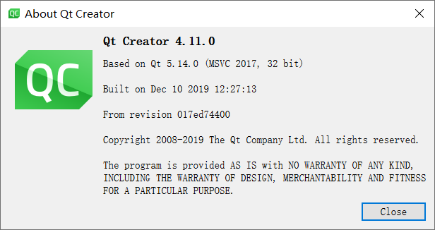

# README

## 前言

### 教程/参考

[QtQuickExamples](https://github.com/zhengtianzuo/QtQuickExamples)

### 参数

#### 硬件

分辨率：15寸，1024 * 768

#### Qt版本



```javascript
import QtQuick 2.7
import QtQuick.Window 2.12
import QtQuick.Layouts 1.3
import QtQuick.Controls 2.3
```

#### 规则记录

1. **自定义qml控件的文件名首字母要大写**

## 需求

顶部状态栏

进度条（环形和竖直线形）

动画显示，注塑机动画流程演示过程，同时可以点击显示部分直接跳转

下拉框，按钮，文字，ICO图标状态、文本框（可编辑）

底部功能按键页面切换

侧边功能按键页面切换

虚拟键盘（数字键盘，可以移动，大小合适）

表格（可编辑），结合数据库SQLite

曲线显示（示波器功能）
Qt（Linux）下共享内存

Group组合

文件导入和导出（读写）

信息输出框

## 流程

### CuteLogger库

[CuteLogger](https://github.com/dept2/CuteLogger)

Simple, convinient and thread safe logger for Qt-based C++ apps。

### 设置字体

qml中可以方便修改字体，但是控件多的时候想批量调整字体会比较麻烦，直接修改程序的默认字体来的简单粗暴有效。

```javascript
QGuiApplication app;
QFont font;
font.setPointSize(16);
font.setFamily("黑体");

app.setFont(font);
```

[Qt5:设置程序默认字体](https://blog.csdn.net/x356982611/article/details/53390303)

### 无边框窗口

```javascript
//在QtQuick实现去除标题栏，也即无边框很简单，只需要在Qml-Window中设置
//但是这个时候的窗体不能拖拽，也不能在窗体的边缘进行拉伸
flags: Qt.Window | Qt.FramelessWindowHint | Qt.WindowMinMaxButtonsHint
```

### 添加程序图标

主程序pro中添加`RC_ICONS = app.ico`

### QML程序启动动画

[Qt实现程序启动动画](https://blog.csdn.net/a849473785/article/details/95939641)

[QT 程序启动动画](https://blog.csdn.net/Sakuya__/article/details/88973724)

[QML: Show animated splash screen at startup](https://falsinsoft.blogspot.com/2017/01/qml-show-animated-splash-screen-at.html)

#### 方法1

博客上关于Qt Weigh程序启动动画有很多，但关于纯QML程序启动动画比较少，Google搜索到了一篇教程《QML: Show animated splash screen at startup》。

main.qml

```javascript
import QtQml 2.2
import QtQuick 2.6

Item {
    Loader {
        id: mainWindowLoader
        active: false
        source: "qrc:/window.qml"
        asynchronous: true
        onLoaded: {
            item.visible = true;
            splashScreenLoader.item.visible = false;
            splashScreenLoader.source = "";
        }
    }

    Loader {
        id: splashScreenLoader
        source: "qrc:/splashscreen.qml"
        onLoaded: {
            mainWindowLoader.active = true;
        }
    }
}
```

有两个Loader，但第一个未激活。在程序启动时，第二个加载器启动。加载窗口启动屏幕后，它将启动第一个加载器，该加载器加载主窗口（不可见）。请注意，由于主窗口是在后台线程中加载的，因此加载优先级低于主线程。这意味着与直接从主线程加载主窗口相比，加载将花费更多时间。

window.qml

```javascript
import QtQml 2.2
import QtQuick 2.6
import QtQuick.Window 2.2
import QtQuick.Controls 2.0

ApplicationWindow {
    id: mainWindow
    flags: Qt.Window | Qt.WindowTitleHint | Qt.WindowSystemMenuHint | Qt.WindowCloseButtonHint
    width: 300
    height: 400
    visible: false
    title: "Scresh Screen Test"

    Component.onCompleted: {
        var timeout = new Date().valueOf() + 3000;
        while(timeout > new Date().valueOf()) {}
    }

    Text {
        text: "Window ready!"
        anchors.centerIn: parent
        font.bold: true
        font.pixelSize: 20
        color: "black"
    }
}
```

#### 方法2

Qt文档也给出了教程，通过定时器实现。[Qt Quick Examples - Window and Screen](https://doc.qt.io/archives/qt-5.9/qtquick-window-example.html)，代码在`Qt\Qt5.14.0\Examples\Qt-5.14.0\quick\window\`下。

### Canvas

### ListModel

[ListModel QML Type](https://doc.qt.io/qt-5/qml-qtqml-models-listmodel.html)

[QML类型——ListModel](https://blog.csdn.net/fengyanyu68/article/details/107609708)

[QML中ListView的几种数据模型](https://blog.csdn.net/qq_35173114/article/details/80873842)

列表数据Model，可以自定义格式。

ListModel是定义ListElement的容器。内容可以动态定义，也可以在QML中明确定义。可以通过count属性获得模型中数据的数量。可以使用模型的setProperty()方法来操作元素，改方法允许设置和更改指定元素属性。

举例：

下面ListModel包含三个元素以及对应的角色（name和cost）。

```javascript
import QtQuick 2.0

ListModel {
    id: fruitModel

    ListElement {
        name: "Apple"
        cost: 2.45
    }
    ListElement {
        name: "Orange"
        cost: 3.25
    }
    ListElement {
        name: "Banana"
        cost: 1.95
    }
}
```

每个元素中的角色（属性）必须以小写字母开头，并且模型中的所有元素公有这些角色。

示例模型中包含一个id属性，因此可以由视图（如ListView）引用它。

#### 修改列表模型

使用clear()、append()、set()、insert()和setProperty()方法创建和修改ListModel的内容，例如：

```javascript
Component {
    id: fruitDelegate
    Item {
        width: 200; height: 50
        Text { text: name }
        Text { text: '$' + cost; anchors.right: parent.right }

        // Double the price when clicked.
        MouseArea {
            anchors.fill: parent
            onClicked: fruitModel.setProperty(index, "cost", cost * 2)
        }
    }
}
```

请注意，动态创建内容时，一旦设置就无法更改属性。无论哪种属性先添加到模型中，都是模型中唯一的属性。

`setProperty(int index, string property, variant value)`

更改列表模型中index索引的元素属性。

`fruitModel.setProperty(3, "cost", 5.95)`

#### 列表模型与WorkerScrip的使用

ListModel可以与WorierScript一起使用，以从==多线程访问列表模型==，如果列表修改是同步的并且需要一些时间没，这将很有用：可以将列表操作移至其他线程，以避免阻塞GUI线程。

举例：

使用WorkerScript定期将当前时间附加到列表模型中：

```javascript
WorkerScript {
    id:worker
    source: "dataloader.mjs"
}
Timer {
    id: timer
    interval: 2000; repeat: true
    running: true
    triggeredOnStart: true

    onTriggered: {
        var msg = {'action': 'appendCurrentTime', 'model': listModel};
        worker.sendMessage(msg);
    }
}
```

datatloader.mjs如下所示：

```javascript
WorkerScript.onMessage = function(msg) {
    if (msg.action == 'appendCurrentTime') {
        var data = {'time': new Date().toTimeString()};
        msg.model.append(data);
        msg.model.sync();   // updates the changes to the list
    }
}
```

示例中的计时器通过调用WorkerScript::sendMessage()将消息发送到工作脚本。dataloader.mjs中WorkerScript.onMessage()收到消息后，将当前时间append到列表模型中。

注意：外部线程通过调用sync()来更新列表显示。sysnc(),在工作脚本中调用，将所有修改项写入列表模型中。can only be called from a WorkerScript。

### ListView

### QML 界面切换的几种方法

[QML 界面切换的几种方法（带示例代码）](https://www.cnblogs.com/linuxAndMcu/p/13566502.html)

[Qt Quick之StackView详解（1）](https://blog.csdn.net/foruok/article/details/46839569)

[Qml SwipeView禁用滑动动画](https://blog.csdn.net/nnngo/article/details/104469660)

#### 使用场景分析

如果想记录上一页的操作，可以使用静态的方式，比如设置用户名的页面，切换到下一页，但也可能返回到上一页。

如果想每次进入页面时，一切从新开始，不想记录任何信息，则使用动态方式。比如登录类切换，登录后一切都应该从新开始。

_StackView、SwipeView会保存上个页面的操作，而Loader不会，再次进入还是刚开始一样。_

#### 静态

##### 1.隐藏法

本质是各页面都存在，只是某些隐藏，某些显示，当某一触发条件满足时，设置对应页面的显示和隐藏。

`            loginPage.visible = true            `            

`mainPage.visible = false`

##### 2.利用StackView、SwipeView

StackView是FocusScope的子类，FocusScope是Item的子类。

StackView实现了一个栈式的导航。“栈”大家都知道是怎么回事儿，就是一种数据结构，先进后出（FILO），支持pop、push等操作。StackView用于栈类似的行为方式管理一系列的View（页面或视图），这些View之间可能有内在联系，根据业务需要，可以一级一级向深处的跳转，当前的View上发生点儿什么事儿，就可能会产生一个新的View或返回之前的页面。

SwipeView由背景和content item组成，导航是content item，是一个ListView 。

#### 动态

##### 1.使用Loader动态加载QML组件

Loader 元素用来动态加载可见的 QML 组件，它可以加载一个 QML 文件（使用 source 属性）或者一个组件对象（使用 sourceComponent 属性）。

```javascript
main.qml
------------------------------------
import QtQuick 2.9
import QtQuick.Window 2.2

Window {
    visible: true
    width: 640
    height: 480
    title: qsTr("Hello World")

    // 1. Loader加载不同组件，实现切换页面的功能
    Loader{
        id:myLoader
        anchors.centerIn: parent // 弹出的界面都居中显示
    }
    Component.onCompleted: myLoader.sourceComponent = loginPage // 一开始显示登录页面

    // 2. 登录页面-Component
    Component{
        id:loginPage
        LoginPage {
            width: 300
            height: 200
            anchors.centerIn: parent
        }
    }

    // 3.主页面-Component
    Component{
        id:mainPage
        MainPage {
            width: 500
            height: 350
            anchors.centerIn: parent
        }
    }
}

LoginPage.qml
------------------------------------
import QtQuick 2.0
import QtQuick.Controls 2.3

Rectangle {
    width: 400
    height: 300
    color: "#051f58"
    radius: 8

    Button {
        text: "登录页面-登录按钮"
        anchors.centerIn: parent
        onClicked: myLoader.sourceComponent = mainPage // 切换显示主页面
    }
}

MainPage.qml
------------------------------------
import QtQuick 2.0
import QtQuick.Controls 2.3

Rectangle {
    color: "#498ff8"
    radius: 8

    Button {
        text: "主页面-返回按钮"
        anchors.centerIn: parent
        onClicked: myLoader.sourceComponent = loginPage // 切换显示登录页面
    }
}
```

##### 2.利用createComponent创建并切换

```javascript
main.qml
------------------------------------
import QtQuick 2.9
import QtQuick.Window 2.2

Window {
    id: mainWin
    visible: true
    width: 640
    height: 480
    title: qsTr("Hello World")

    LoginPage {
        width: 300
        height: 200
        anchors.centerIn: parent
    }
}

LoginPage.qml
------------------------------------
import QtQuick 2.0
import QtQuick.Controls 2.3

Rectangle {
    id: loginPage
    width: 400
    height: 300
    color: "#051f58"
    radius: 8
    clip:true

    Button {
        text: "登录页面-登录按钮"
        anchors.centerIn: parent
        onClicked: {
            // 隐藏登录页面
            loginPage.visible = false // 不能销毁，否则下面的"主页面"也会跟随销毁，则后面
            // 点击"主页面-关闭按钮"，将无法销毁关闭"主页面"

            // 在主窗口（mainWin）上显示主页面
            var compMainPage = Qt.createComponent("MainPage.qml")
            .createObject(mainWin, {x:50, y:50, width:200, height:250});
        }
    }
}

MainPage.qml
------------------------------------
import QtQuick 2.0
import QtQuick.Controls 2.3

Rectangle {
    id: mainPage
    color: "#498ff8"
    radius: 8

    Button {
        text: "主页面-关闭按钮"
        anchors.centerIn: parent
        onClicked: {
            // 销毁关闭主页面
            mainPage.destroy()
        }
    }
}
```

使用`compLogin.destroy()`来销毁登录页面以达到关闭的效果，同时节省内存。

### Repeater重复器

[QML之Repeater重复器](https://segmentfault.com/a/1190000021284658)

[Qml学习笔记-Repeater的基本使用](https://blog.csdn.net/qq78442761/article/details/81218839)

**Repeater控件用于创建大量类似的项**。与其他视图控件(ListView，PathView)类似。单纯使用Repeater控件没多大作用，一般与布局类控件(Row，Column，Grid)搭配使用。

#### 使用场景

- Repeater更多的作用是用于展示多个重复项，不是用来交互(滑动)。
- 仅仅是用于项比较少的情况下，用Repeater代替ListView等视图项会有性能上的提升。

#### 使用文档

##### 属性

- count：共有多少实例项。
- delegate：用于界面显示的委托项(_当Repeater下只有一个控件时可以省略写该标记_)。
- model：数据模型项，用于为_delegate_提供数据支持。

##### 信号

- itemAdded(int index, Item item)：当Repeater有项增加时触发该信号。
- itemRemoved(int index, Item item)：当Repeater有项被移除时触发该信号。

##### 方法

- Item itemAt(index)：通过下标查找Repeater的项。

#### 示例

```javascript
ListModel {
    /* 数据项 */
    id: myModel
    ListElement { colour: "red"; }
    ListElement { colour: "blue"; }
    ListElement { colour: "green"; }
}

Component {
    /* 代理项(实例) */
    id: myDelegate
    Rectangle {
        width: 80; height: 50
        color: colour /* 通过数据项(model)映射获得。 */

        MouseArea {
            anchors.fill: parent
            /* 点击添加一个数据项，界面因此会多一个项显示。 */
            onClicked: myModel.append({colour: "lightblue"})
        }
    }
}

Row {
    Repeater {
        id: repeater
        model: myModel
        delegate: myDelegate
        onItemAdded: console.log("Add Item.", index, item.color)
        onItemRemoved: console.log("Remove Item.", index, item.color)
    }
}
```

上面是一个典型的M-V-D模型，在QtQuick中，数据通过model-view（模型-视图）分离。对于每个view（视图），每个数据元素的可视化都分给一个代理（delegate）。

```javascript
Window {
    visible: true
    width: 150
    height: 500
    title: qsTr("RepeaterDemo")
    Column{
        spacing:2
        Repeater{
            model:ListModel{
                ListElement{name:"Mercury";surfaceColor:"gray"}
                ListElement{name:"Venus";surfaceColor:"yellow"}
                ListElement{name:"Earth";surfaceColor:"blue"}
                ListElement{name:"Mars";surfaceColor:"orange"}
                ListElement{name:"Jupiter";surfaceColor:"orange"}
                ListElement{name:"Saturn";surfaceColor:"yellow"}
                ListElement{name:"Uranus";surfaceColor:"lightBlue"}
                ListElement{name:"Neptune";surfaceColor:"lightBlue"}
            }
            Rectangle{
                width: 150
                height: 50
                radius: 8
                color:"lightBlue"
                Text{
                    anchors.centerIn: parent
                    text:name
                }
 
                Rectangle{
                    anchors.left: parent.left
                    anchors.verticalCenter: parent.verticalCenter
                    anchors.leftMargin: 2
 
                    width:32
                    height:32
                    radius: 16
                    border.color: "black"
                    border.width: 1
                    color: surfaceColor
                }
            }
        }
    }
}

```

注意==model==。

### QML翻译

1.编写含有qsTr()的程序。`text: qsTr(“国际化”)`

2.pro文件中加入`TRANSLATIONS = zh_CN.ts en_US.ts`

3.生成ts文件，通过Qt 外部->Qt语言家->更新翻译 生成.ts文件

4.打开qt Linguist对qsTr的英文进行翻译

5.通过Qt 外部->Qt语言家->更新翻译和发布翻译，生成.qm文件

6.调用.qm文件

```c++
#include "QmlLanguage.h"

QmlLanguage::QmlLanguage(QGuiApplication &app, QQmlApplicationEngine& engine)
{
    m_app = &app;
    m_engine = &engine;
}

void QmlLanguage::setLanguage(int nLanguage)
{
    QTranslator translator;
    if (nLanguage == 0)
    {
        translator.load(":/en_US.qm");
    }else{
        translator.load(":/zh_CN.qm");
    }
    m_app->installTranslator(&translator);
    m_engine->retranslate();
}
```

==retranslate是5.10才有的接口。==

**Linguist**工具确实有一些弱，不要好用。最终还是生产.qm文件。明显的问题是，只能翻译静态的内容，动态加载的ListModel，动态切换语言时不能自动刷新。

具体可以查看[Qml组件化编程12-多国语言动态翻译](https://zhuanlan.zhihu.com/p/148305427)和[QML程序实现动态切换多语言](https://zhuanlan.zhihu.com/p/40815590)。

用过`ListModel`的朋友应该都知道，`ListElement`的字段是无法进行属性绑定的。也就是说，它里面的文本无法用我们上面的机制进行刷新。那怎么办呢？Qt为我们准备了一个宏：`QT_TR_NOOP`，它可以解决这个问题。

```javascript
        Rectangle {
            width: 200
            height: 200
            anchors.horizontalCenter: parent.horizontalCenter
            ListModel {
                id: fruitModel

                ListElement {
                    name: QT_TR_NOOP("Apple")
                    cost: 2.45
                }
                ListElement {
                    name: QT_TR_NOOP("Orange")
                    cost: 3.25
                }
                ListElement {
                    name: QT_TR_NOOP("Banana")
                    cost: 1.95
                }
            }

            Component {
                id: fruitDelegate
                Row {
                    spacing: 10
                    Text { text: qsTr(name) }
                    Text { text: '$' + cost }
                }
            }

            ListView {
                anchors.fill: parent
                model: fruitModel
                delegate: fruitDelegate
            }
        }
```

### 截图

参考[qml应用截屏](https://blog.csdn.net/weixin_43935710/article/details/103696397)，使用`legendView.grabToImage(function(result) {          console.log(result.saveToFile("something.png"));
                });`,legendView是控件的ID，但无法截取整个ApplicationWindow。可以参考[qml程序屏幕截图的两种方法（适用不带X window的linux环境）](https://blog.csdn.net/weixin_44173991/article/details/98739677)。

.h 文件

```c++
#include <QDebug>
#include <QImage>
#include <QSharedPointer>
#include <QQuickItem>
#include <QQuickItemGrabResult>
#include <QQuickWindow>

class ScreenShot : public QObject
{
    Q_OBJECT
public:
    explicit ScreenShot(QObject *parent = nullptr);

    Q_INVOKABLE void shootScreen(QObject *itemObj);	//截图控件

    Q_INVOKABLE void shootScreenWindow(QQuickWindow *rootWindow);	//截图窗口

private slots:
    void saveimage();

private:
    QQuickItem      *grabItem;
    QSharedPointer<QQuickItemGrabResult> grabResult;
};

```

.cpp文件

```C++
#include <QDateTime>

ScreenShot::ScreenShot(QObject *parent) : QObject(parent)
{

}

void ScreenShot::shootScreen(QObject *itemObj)
{
    grabItem = qobject_cast<QQuickItem*>(itemObj);
    grabResult = grabItem->grabToImage();

    QQuickItemGrabResult * grabResultData = grabResult.data();
    connect(grabResultData,SIGNAL(ready()),this,SLOT(saveimage()));
}

void ScreenShot::shootScreenWindow(QQuickWindow *rootWindow)
{
    QImage image = rootWindow->grabWindow();
    QString filePathName = "/myPath/";
    filePathName += QDateTime::currentDateTime().toString("yyyy-MM-dd hh-mm-ss-zzz");
    filePathName += QString(".jpg");
        
    image.save(filePathName,"JPG");
}

void ScreenShot::saveimage()
{
    QString filePathName = "/myPath/";
    filePathName += QDateTime::currentDateTime().toString("yyyy-MM-dd hh-mm-ss-zzz");
    filePathName += QString(".jpg");
    QImage img = grabResult->image();
    if(img.save(filePathName)){
        qDebug("save sucessfully!");   
    }
}
```

将ScreenShot的实例注册到qml中，可以在qml中直接调用，一般在main函数中注册：

main.cpp

```c++
int main(int argc, char *argv[])
{
    QApplication app(argc,argv);
    QQmlApplicationEngine engine;
    ScreenShot screenshot;
    engine.rootContext()->setContextProperty("screenshot", &screenshot);
	...
	return app.exec();
}
```

.qml

```javascript
ApplicationWindow {
    id:rootWindow
    visible: true

    Button{
        id: button
        width: 1280
        height: 800
		onClicked:
		{
			screenshot.shootScreen(button)
			screenshot.shootScreenWindow(rootWindow)
		}
	}
	...
}

```

需要先创建好文件夹，否则会报错`No appenders associated with category qml`？

### 复选框

[ButtonGroup QML Type](https://doc.qt.io/qt-6/qml-qtquick-controls2-buttongroup.html)

```javascript
ButtonGroup { id: radioGroup }

Column {
    Label {
        text: qsTr("Radio:")
    }

    RadioButton {
        checked: true
        text: qsTr("DAB")
        ButtonGroup.group: radioGroup
    }

    RadioButton {
        text: qsTr("FM")
        ButtonGroup.group: radioGroup
    }

    RadioButton {
        text: qsTr("AM")
        ButtonGroup.group: radioGroup
    }
}
```

### 自定义模块

[让Qt Creator更懂我们的自定义模块](https://zhuanlan.zhihu.com/p/139517014)

[qml-自定义quick模块](https://www.jianshu.com/p/163666976f96)

[QML自定义组件实现（扩展插件）](https://blog.csdn.net/w_419675647/article/details/104859365)

[QML插件扩展](https://blog.csdn.net/yizhou2010/article/details/87620776)

[玩转Qml(10)-自定义Quick模块](https://blog.csdn.net/D759378563/article/details/111872181)

#### 基本概念

**qmldir:**
用于组织自定义的QML插件。

**.qmltypes：** qml插件的解释文件，用于QtCreator语法高亮。可通过Qt提供的工具_qmlplugindump_自动生成。

**QML_IMPORT_PATH:** 导入插件路径，以支持插件的语法高亮。个人理解是如果纯QML文件的扩展，没有封装到C++中，则直接导入路径，即可支持语法高亮，如果有C++封装，则需要通过.qmltypes支持高亮。

**addImportPath:** 添加import寻址目录，c++代码里添加，没有前两项，只是QtCreator不能高亮，没有这种，则插件无法使用。

#### 目的

将自己写的可通用的qml组件打包成dll文件，供其他项目使用。通过生成qmltypes文件实现在qt creator中正常识别，能够自动补全。项目不需要任何多余操作，直接import即可使用。

#### 新建项目


#### 编写组件

在项目中编写自定义的QML组件，可以参考Qt官方的定制教程[Customizing Qt Quick Controls](https://doc.qt.io/qt-5/qtquickcontrols2-customize.html#customizing-combobox)，新建qrc资源管理文件，将组件的QML文件包含在qrc文件中（_为的是导出dll插件时，不用带上qml源码_）。借鉴如上教程中，对Button的定制代码,新建InoButton.qml。

```javascript
import QtQuick 2.12
import QtQuick.Controls 2.12
Rectangle {
    id: root
    property alias textItem: t      //导出Text实例，方便外部直接修改
    property alias text: t.text     //导出文本
    property alias textColor: t.color   //导出文本颜色
    property alias containsMouse: area.containsMouse    //导出鼠标悬浮
    property alias containsPress: area.containsPress    //导出鼠标按下
    signal clicked();               //自定义点击信号
    color: "transparent"
    Text {
        id: t
        //默认坐标居中
        anchors.centerIn: parent
        //默认文字对齐方式为水平和垂直居中
        verticalAlignment: Text.AlignVCenter
        horizontalAlignment: Text.AlignHCenter
        //默认宽度为parent的宽度，这样字太长超出范围时自动显示省略号
        width: parent.width
        elide: Text.ElideRight
    }

    MouseArea {
        id: area
        anchors.fill: parent;
        hoverEnabled: parent.enabled;
        onClicked: root.clicked();  //点击时触发自定义点击信号
        cursorShape: Qt.PointingHandCursor  //悬浮或点击时的鼠标样式
    }
}

```

**注册组件**

在插件类的registerTypes成员函数中(`inocontrols_plugin.cpp`)注册自定义组件插件。


**编写qmldir**

```bash
#模块名
module InoControls
#构建项目生成的dll文件名
plugin InoControls

#依赖的模块
depends QtQuick 2.7
depends QtQuick.Controls 2.3

#项目中继承自QQmlExtensionPlugin的类名
classname InoControlsPlugin
#要生成的类型解释文件的名字
typeinfo plugin.qmltypes
```

**Release下构建**

在Release下构建组件项目，生成.dll文件（Windows下）。

#### 生成qmltypes文件

_.qmltypes_可以在qtcreator中对组件进行提示和语法高亮。Qt其实自带了一个工具，位于bin目录里的qmlplugindump，是个命令行工具，可以用来生成_.qmltypes_文件。生成_.qmltypes_文件过程也是探索了蛮久的，按照如下步骤进行：

1. 将Release模式下生产的*.dll*拷贝到项目目录下，如图所示：

   

2. 命令行下执行

   `/c/Qt/Qt5.14.0/5.14.2/mingw73_64/bin/qmlplugindump.exe InoControls 1.0 ../../Injection/ -nonrelocatable > ./plugin.qmltypes`

   `/c/Qt/Qt5.14.0/5.14.2/mingw73_64/bin/qmlplugindump.exe` : qmlplugindump工具

   `InoControls` : 组件名字

   `1.0` : 版本号，导入的时候 `import InoControls 1.0`

   `../../Injection/` : 包含了工程文件夹的目录

   `-nonrelocatable` ： 添加导出组件的位置

   `>` : 生成输出位置，可以用`-output`

   `./plugin.qmltypes` : 当前目录下的plugin.qmltypes

   

   **注意**

   不加命令`-nonrelocatable` 生成的`.qmltypes`中导出组件没有路径，后面还是会找不到组件报错。

   没有加`-nonrelocatable`生成的`.qmltypes`

   

   加`-nonrelocatable`生成的`.qmltypes`

   

   下面也有生产错误的报错截图：

   

3. 添加到qt安装目录下

   `C:\Qt\Qt5.14.0\5.14.2\mingw73_64\qml\`下新建跟组件工程名一样的文件夹，放入`.dll、.qmltypes 、qmldir`文件即可，那么在别的工程中，就可以导入你写的自定义组件，并且有代码提示和语法高亮。

   

   

### 插件

[Qt插件之深入理解插件系统](https://blog.csdn.net/a844651990/article/details/92786894?spm=1001.2014.3001.5501)

### 用户配置

#### Qt.labs.settings

QML用Qt.labs.settings实现保存用户设置。

main.cpp中设置程序信息

```javascript
QGuiApplication::setApplicationName("Gallery");
QGuiApplication::setOrganizationName("QtProject");
QGuiApplication::setAttribute(Qt::AA_EnableHighDpiScaling);
```

在需要保存设置的qml中

```javascript
import Qt.labs.settings 1.1
    Settings {
        id: settings
        property string input: "Default"
    }
```

修改的参数会被保存。

#### 使用JSON文件

使用JSON文件，对系统进行配置。

### SQLite

[第十二章：QML使用Sqlite数据库](https://blog.csdn.net/qq_40602000/article/details/109554063)

[QML使用Sqlite数据库](https://blog.csdn.net/zuoyefeng1990/article/details/50250495)

[SQLite Expert](http://www.sqliteexpert.com/download.html)

[Qt Quick Local Storage QML Types](https://doc.qt.io/qt-5/qtquick-localstorage-qmlmodule.html)

[SQLite 日期 & 时间](https://www.runoob.com/sqlite/sqlite-date-time.html)

#### LocalStorage访问SQLite数据库

QtQuick通过LocalStorage访问SQLite数据库，完成增删改查。

1.设置数据库存储路径，如果不设置路径，就不清楚数据库不知道存放在什么位置。

```javascript
    QQmlApplicationEngine engine;
    //设置SQLite数据库存储路径
    engine.setOfflineStoragePath("./SQLiteDB");
    const QUrl url(QStringLiteral("qrc:/main.qml"));
```

数据库路径是在==Debug==下的SQLiteDB文件夹下。

2.QML中导入LocalStorag

`import QtQuick.LocalStorage 2.0`

3.添加一个数据库操作JS文件：database.js，该文件存放所有数据库操作函数，便于维护和方便模块化管理数据库。

```javascript
var db;

function initDatabase() {
    db = LocalStorage.openDatabaseSync("CrazyBox", "1.0", "The Example QML SQL!", 100000);
    try {
         //Create the database if it doesn't already exist
        db.transaction( function(tx) {
            tx.executeSql('CREATE TABLE IF NOT EXISTS data(name TEXT, value TEXT)');
        })
    } catch (err) {
           console.log("Error creating table in database: " + err)
       };
}

function readData(name) {
    var res="";
    if(!db) { return; }
    db.transaction( function(tx) {
        var result = tx.executeSql('select value from data where name=?', [name]);
        if (result.rows.length > 0) {
             res = result.rows.item(0).value;
        } else {
            res = "Unknown";
        }
    })
    return res
}

function insertData(name, value) {
    var res = "";
    if(!db) { return; }
    db.transaction( function(tx) {
        var result = tx.executeSql('INSERT OR REPLACE INTO data VALUES (?,?);', [name, value]);
        if (result.rowsAffected > 0) {
          res = "OK";
        } else {
          res = "Error";
        }
    })
    return res
}

```

能够创建一个叫做“CrazyBox”的数据库，并在它里面生产一个叫做data的表。

4.在qml中初始化并调用函数即可。

```javascript
import QtQuick.LocalStorage 2.0
import "./QML/JavaScript/database.js" as DB

Component.onCompleted: {
    DB.initDatabase();
    DB.insertData("color","red");
    DB.insertData("book","love");
}
```


_LocalStorage访问SQLite数据库，创建的数据库名字不是取的名字。_

#### QML调用C++读写SQLite

[QT5中使用SQLite](https://blog.csdn.net/weixin_41656968/article/details/80473137)

[42.QT-QSqlQuery类操作SQLite数据库(创建、查询、删除、修改)详解](https://www.cnblogs.com/lifexy/p/10921958.html)

[Qt中SQL QSqlQuery 对象中prepare() 函数的用法](https://blog.csdn.net/Superman___007/article/details/100552331)

QT Creator自带的SQLite驱动。通常用的方法，`QSqlDatabase db = QSqlDatabase::addDatabase("QSQLITE")`这样建立连接。

1.修改.pro文件，添加SQL模块

`QT += sql`

或者添加

`TARGET = sqlite`

##### SQL中使用变量

为什么需要要绑定:这是因为在prepare（）中虽然是标准的SQL指令，但是对于具体的数值类的量不可能在string表示出来，那么不能表示的量就用？代替，这样就需要额外添加绑定指令addBindValue（），把prepare（）中用？表示的量替换成相对应的数值量（int，floaat,QString等等），而且替换是是按照？出现顺序替换的，然后在执行exec（）时就可以更新到数据库中或者可以用:string而不用？（string就代表一个字符串而已），这时我们可以用bindValue(“:string”,value);去绑定数据单，然后更新，这个就可以不按照出现顺序绑定。但是：string一定是和它要替换的列的值对应的。而且绑定还可以省略，也就是设为NULL。

在使用prepare（）函数后，我们还得使用**addBindValue(value)按照上面的item顺序来绑定值，**具体值为value（该值一定要和对应的item想对应）！！！绑定成功后调用exec（）就可以执行插入操作，写入数据库，成功与否就看exec（）返回值了。

```c++
//例如：用第一种方法绑定
sql_query.prepare("INSERTINTOPersons(id,name,slary)VALUES(?,?,?)");
sql_query.addBindValue(2);
sql_query.addBindValue("taopeng");
sql_query.addBindValue(25);
if(sql_query.exec())
```

```c++
//或者：第二种方法：
sql_query.prepare("INSERTINTOPersons(id,name,age)VALUES(:id,:name,:bbb)");
sql_query.bindValue(":id",4);
sql_query.bindValue(":name","taopeng");
sql_query.bindValue(":bbb",25);
```

qmlplugindump.exe -nonrelocatable InoControls 1.0 /c/Qt/Qt5.14.0/5.14.2/mingw73_64/qml/InoControls > /c/Qt/Qt5.14.0/5.14.2/mingw73_64/qml/InoControls/plugins.qmltypes


Failed to extract plugin meta data from
